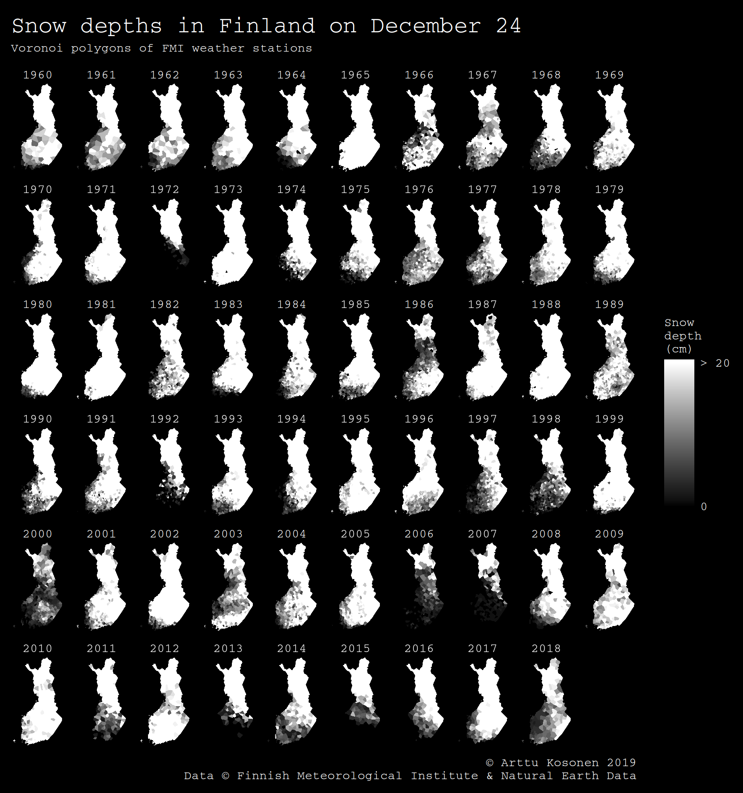

# 30 day map challenge: black and white

See [#30daymapchallenge](https://twitter.com/tjukanov/status/1187713840550744066?s=20) on Twitter.



## FMI API

Request snow depth observations from the Finnish Meteorological Institute's simple feature API.
The base URL with the stored query is the following:

```
http://opendata.fmi.fi/wfs?service=WFS&version=2.0.0&request=getFeature&storedquery_id=fmi::observations::weather::daily::simple
```

We add the following parameters to it:

```
&starttime=[year]-12-24T00:00:00Z       # Request one 24.12. date at a time,
&endtime=[year]-12-24T23:59:59Z         # iterating over years 1960-2019.
&timestep=1440                          # 24*60 == 1440 minutes, one result timestamp per date.
&crs=EPSG::3067                         # Get station coordinates in the CRS we are going to use anyway.
&bbox=19.45,59.71,31.58,70.11,EPSG:4326 # Bounding box of Finland; I found it more easily in WGS84.
&parameters=snow                        # We only need snow parameter, not rain, temperature, etc.
```

So here is a full example URL ready to use with `curl` or `httr`, for example.

```
http://opendata.fmi.fi/wfs?service=WFS&version=2.0.0&request=getFeature&storedquery_id=fmi::observations::weather::daily::simple&starttime=1960-12-24T00:00:00Z&endtime=1960-12-24T23:59:59Z&timestep=1440&crs=EPSG::3067&bbox=19.45,59.71,31.58,70.11,EPSG:4326&parameters=snow
```
